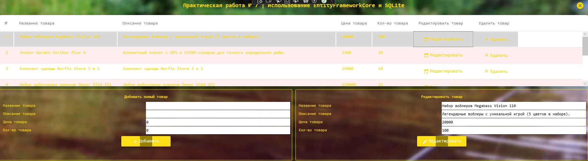

<h1>Задание 7. Система управления товарами</h1>

  WPF-приложение для работы с каталогом товаров, включающее:
  <ul>
    <li>Добавление новых товаров</li>
    <li>Редактирование существующих позиций</li>
    <li>Удаление товаров из каталога</li>
    <li>Просмотр всего ассортимента</li>
  </ul>

  <strong>Техническая реализация:</strong>
  <ul>
    <li>Entity Framework Core для работы с данными</li>
    <li>SQLite как встроенное решение для хранения данных</li>
    <li>WPF для пользовательского интерфейса</li>
  </ul>

  <strong>Запуск приложения:</strong>
  Для начала работы необходимо запустить исполняемый файл "Task7SQLite.exe"

  

